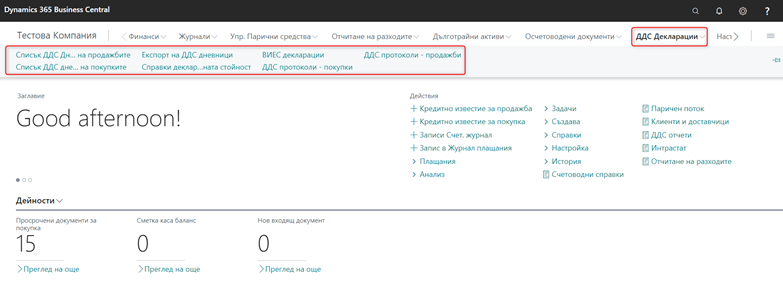

# ДДС функционалност

Функционалността за ДДС, като част от пакета Локализация за България, покрива необходимите изисквания за отчетност по ДДС. По-долу са разгледани специфичните настройки и начини на работа със системата.

Основното меню за работа с функционалността е изведено в ролевия център **Счетоводител** :

## ДДС настройки

### Общи настройки

Първоначалните настройки за ДДС се намират в страница **BG, ДДС и VIES Настройки**.

Тази страница съдържа специфични настройки относно проверките за валидност на номерата по ЗДДС и БУЛСТАТ, описания на услугите в дневниците по ДДС, попълване на определени реквизити при печат на декларации и документи.

Picture1_vat_functionality
- Раздел **Проверки**
	  - Без проверка за валидност на **Идентификационен номер** - поставете отметка ако не желаете системата да проверява валидността на номерата по БУЛСТАТ
	- ИН по ЗДДС за чужденци – попълнете регистрационния номер на лицата и фирмите извън ЕС. Този номер служи за контрола при попълване на номерата в картите на контрагента. (999999999999999) Системата проверява дали попълнения ИН по ЗДДС в картата на контрагента съответства на попълнения тук номер.
 	- Идентификационен номер на чужденеца – попълнете регистрационния номер на лицата и фирмите извън ЕС. Този номер служи за контрола при попълване на номерата в картите на контрагента. (9999999999) Системата проверява дали попълнения ИН по ЗДДС в картата на контрагента съответства на попълнения тук номер.
- Раздел **Настройка на експорт с ДДС**
	- ДДС описание на продажби – Попълнете описание за продажба, което ще се зареди по подразбиране в редовете на Дневника за продажби. Ако в даден документ за продажба полето **Описание за ДДС** не бъде попълнено, в редовете на дневника ще се попълни по подразбиране стойността на това поле.
	- ДДС описание на покупки – Попълнете описание за покупка, което ще се зареди по подразбиране в редовете на Дневника за покупки. Ако в даден документ за покупка полето **Описание за ДДС** не бъде попълнено, в редовете на дневника ще се попълни по подразбиране стойността на това поле.
	- Вкл. продажби с митническа декл. – При попълване на ЕАД No. в документа за продажба включването на тази опция позволява този документ да се включи в Дневника за продажби
	- Вкл. покупки с митническа декл. - При попълване на ЕАД No. в документа за покупка включването на тази опция позволява този документ да се включи в Дневника за покупки
- Раздел **ДДС етикет**
	- Представляващ – въвежда се ЕГН/Трите имена на представляващия. Тези данни се отразяват във файла, който се генерира за експорт към НАП.
	- Дата на последна регистрация по ЗДДС – попълва се датата на регистрация на фирмата по ЗДДС
	- Дата на последно прекратяване на регистрация по ЗДДС – попълва се датата на прекратяване на регистрацията по ЗДДС
- Раздел **ДДС декларации**
	- Лице, подписало спр. декл. - въвеждат се имената на лицето, отговорно за подаване на ДДС дневниците. Името се печата в ДДС дневниците.
	- Длъжност - въвежда се длъжността на лицето, отговорно за подаване на ДДС дневниците. Длъжността се печата в ДДС дневниците.
- Раздел **Локални настройки**
	- BG код на държава / регион – Системно поле. Попълва се кода за България (BG).
	- Локален език код – попълва се BGR за България. Свързано е с печата на документи на български език.

